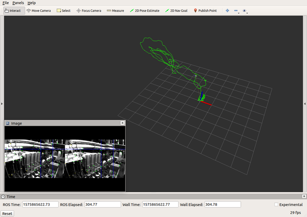
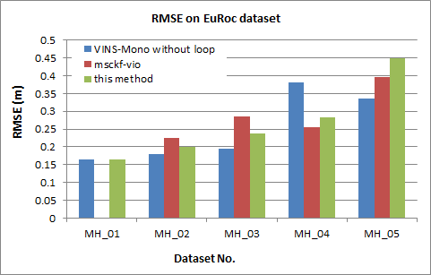
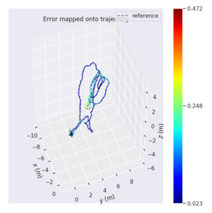
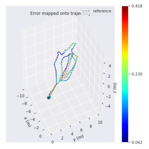
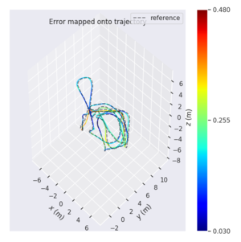
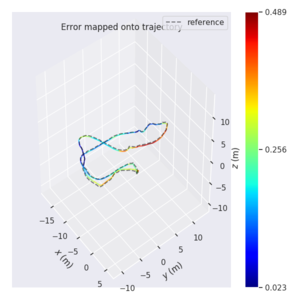
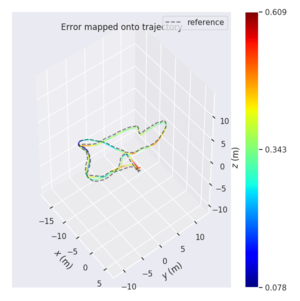

# 背景
目前开源的[MSCKF_VIO](https://github.com/KumarRobotics/msckf_vio)代码只支持从静止状态初始化，动态初始化可能会导致运动估计失败。  
本项目借鉴[VINS-Mono](https://github.com/HKUST-Aerial-Robotics/VINS-Mono)的初始化策略，通过在[MSCKF_VIO](https://github.com/KumarRobotics/msckf_vio)框架中追加动态初始化模块，尝试解决这一问题。
# 主要工作
1.构建视觉&IMU松耦合的动态初始化模块，并将其融入到MSCKF_VIO的框架中。  
2.在动态初始化模块中使用滑窗，使得该模块在静态初始化场景下也有良好的表现。  
3.在[EuRoc数据集](https://projects.asl.ethz.ch/datasets/doku.php?id=kmavvisualinertialdatasets)上进行测试验证。
# 测试结果
与原系统的对比测试结果如下：
1. 本项目代码在动态和静态初始化场景中均可正常运行。
2. 位姿估计精度与原系统相当。
# 详细测试数据
## 运行状态  
NG：轨迹发散； OK: 轨迹正常

| EuRoc 序列 | 初始化场景 |原系统(MSCKF_VIO) | 本项目(MSCKF_VIO+动态初始化) |
|:----------|:---------|:--------------|:------|
| MH_01 | 动态 | NG | OK |
| MH_02 | 动态 | OK | OK |
| MH_03 | 静态 | OK | OK |
| MH_04 | 静态 | OK | OK |
| MH_05 | 静态 | OK | OK |

从上表可以看出：
* 原系统在部分动态初始化场景下（MH_01）无法正常运行。
* 增加动态初始化模块后，本项目代码在动态和静态场景中均可正常运行。

本项目使用MH_01序列的运行状态如下：
  
## 系统精度
本项目(this method)，原系统（msckf_vio），VINS-Mono不开启闭环检测（VINS-Mono without loop）三者精度相当。  
* 数据来源：重复运行三次，取测试结果平均值。（ubuntu 18.04 + i5 + 4G RAM）
* 原系统在MH_01（动态初始化场景）上不能正常运行，没有RMSE数据。

  
## 轨迹Map
本项目在EuRoc MH_01～05运行结果的轨迹Map图：

   
   
 
